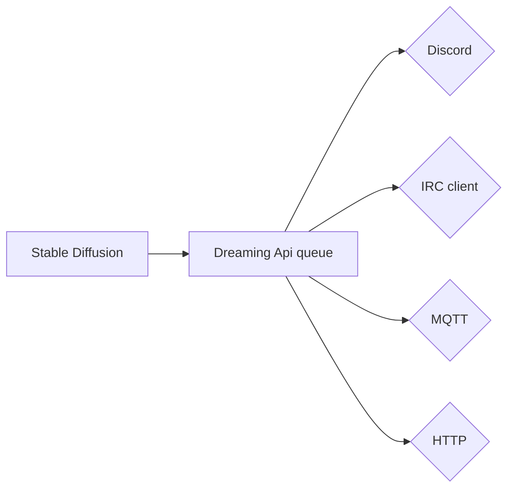

# Dreaming API
This is a simple API end-point as well as a web interface that sits between [lstein fork of Stable Diffusion](https://github.com/lstein/stable-diffusion) and enables a queueing system.

## Why
Lstein's fork is wonderful. But, just as any other Stable Diffusion fork that has an web interface; it is single-user based. That's where Dreaming API comes in. It allows jobs to be queued and executed sequentially on a first in, first processed basis. Using [FastAPI](https://fastapi.tiangolo.com) and [Redis](https://redis.io).  This allows people on IRC, Discord and via the web interface to all use Stable Diffusion at the same time and just wait for their turns. 

## Web interface
The web interface is based on the one that comes with Lstein's fork, as such all credits go to the developers working on it. Some simple changes has been applied to the code to make it more fit for the API and also suite our own needs. 

## API 
Currently I am still in the progress of making the API a little neater, as well as add a slightly easier end point to add a new job. 

## Config
This is still to be written.

## Diagram
An example diagram as how we use dreaming API

